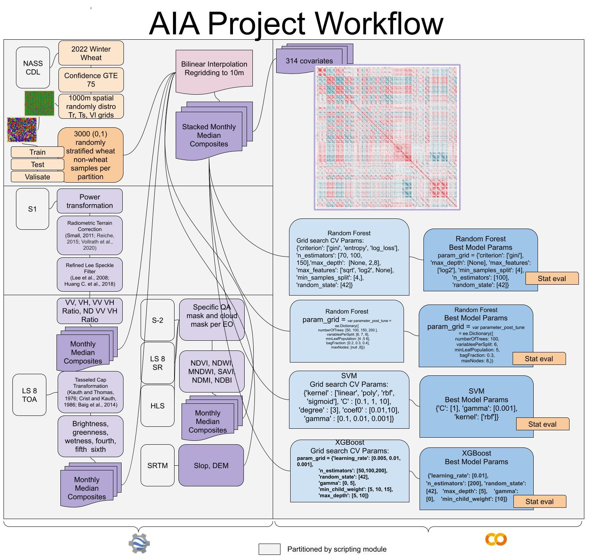

# AIA_Project
AIA_Project

AIA project focused on binary wheat cropt type extent mapping effort utilizing mutliepl ML and DL approaches

Scripts and Repo created by: Tim Mayer

This Github contianes both JS and Python
JS in GEE with Repo as public: https://code.earthengine.google.com/?accept_repo=users/tjm0042/AIA_Repo and is to be deployed as a Module
Python in Colab

Training sample genertaiton scritps
EO pre and processsign scripts
ML notebooks 
Past CSVs with trainign data
For effecient operaiton a high through put GEE cloud project and a Colab Pro are suggested
